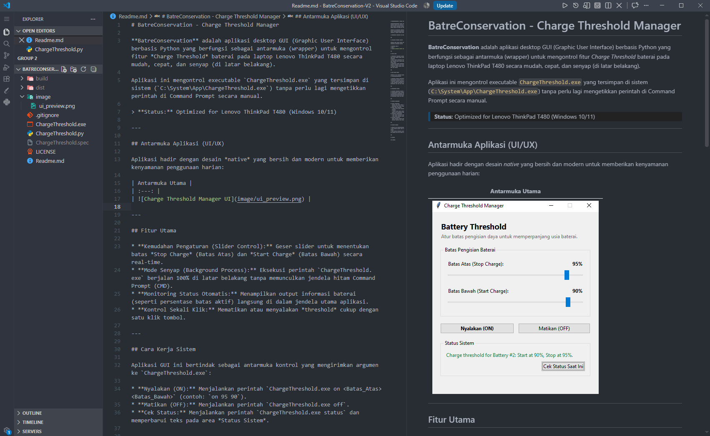

# VS Code Zed-Like Minimal Setup (2026 Edition)

> Konfigurasi VS Code minimalis terinspirasi Zed Editor - clean UI, smooth scroll, terminal split-view kanan, Nushell default, dan Discord Rich Presence stabil tanpa status bar berisik.


---

## Preview UI

>  Semua screenshot disimpan di folder [`./images/`](./images/)

### Tampilan Utama Clean Editor + Terminal Kanan



**Ciri khas:**
- ❌ Tidak ada tab bar (`workbench.editor.showTabs: "none"`)
- ❌ Tidak ada status bar (`workbench.statusBar.visible: false`)
- ✅ Minimap hanya blok warna, muncul jelas saat hover
- ✅ Scrollbar 6px, auto-hide saat tidak aktif
- ✅ Terminal split di sisi kanan (Zed-style) dengan Nushell
- ✅ Activity Bar compact, navigasi minimalis ala macOS

## Fitur Utama

| Kategori | Fitur |
| :--- | :--- |
| **UI Declutter** | No status bar, no tabs, compact menu bar, hidden view containers |
| **Scroll Enhanced** | Smooth scrolling, fast scroll (Alt+wheel), minimap click-to-jump |
| **Terminal** | Split-view kanan, Nushell default, FiraCode Nerd Font |
| **Discord Presence** | Crawl's Discord Presence, anti-idle, deteksi `.ipynb` khusus Data Science |
| **Editor** | Line numbers normal, auto-save, bracket pair disabled, indent guides off |
| **Navigation** | File nesting, auto-reveal focus, compact explorer, outline/timeline hidden |

---

## Prasyarat

### Extension Wajib

| Extension | ID Marketplace | Fungsi |
| :--- | :--- | :--- |
| **ZED One Theme Dark** | *(search "ZED One Theme")* | Tema utama dark minimalis |
| **Material Icon Theme** | `PKief.material-icon-theme` | Icon file/folder modern |
| **Discord Presence** | `icrawl.discord-vscode` | Rich Presence stabil + deteksi .ipynb |
| **vscode-pets** | `tonybaloney.vscode-pets` | Pet putih di editor (opsional) |

### Extension Pendukung (Opsional)

- `ritwickdey.LiveServer` - Live preview HTML
- `formulahendry.code-runner` - Run code snippet
- `ms-vscode.cpptools` - C/C++ IntelliSense
- `ms-vscode.cmake-tools` - CMake integration
- `redhat.vscode-community-server-connector` - Server connector
- `RooVeterinaryInc.roo-cline` - AI coding assistant

### Font & Shell

- **[FiraCode Nerd Font](https://www.nerdfonts.com/font-downloads)** - untuk terminal dengan icon support
- **[Nushell](https://www.nushell.sh/)** - shell modern, ringan, dan customizable (default terminal)

### External Tools (Windows)

- [Git for Windows](https://git-scm.com/download/win)
- [MSYS2](https://www.msys2.org/) - untuk bash profile tambahan & compiler GCC
- MinGW-w64 via MSYS2 (`ucrt64`) - compiler C/C++

---

## Instalasi

### 1. Backup Settings Lama (Wajib)

```powershell
Copy-Item "$env:APPDATA\Code\User\settings.json" "$env:APPDATA\Code\User\settings.json.bak.$(Get-Date -Format 'yyyyMMdd')"